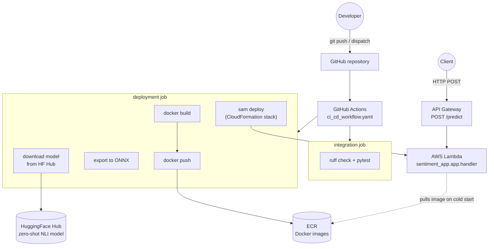
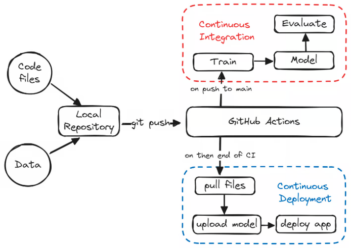
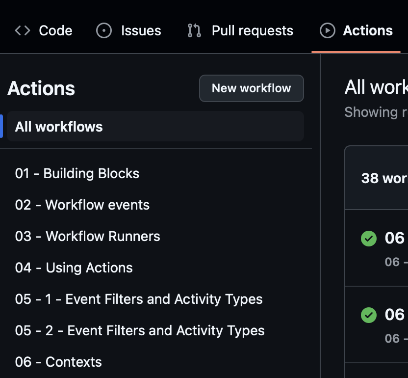
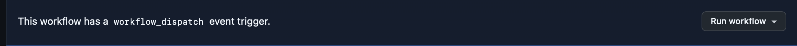

# Lab 11 - Deployment & CI/CD

## Table of contents

- [1. Introduction](#1-introduction)
- [2. Project setup](#2-project-setup) - Exercise 1
- [3. CI pipeline](#3-ci-pipeline) - Exercise 2
- [4. Optimization & containerization](#4-optimization--containerization) - Exercise 3
- [5. Continuous deployment (AWS)](#5-continuous-deployment-aws) - Exercise 4
- [Grading](#grading-10-points)

## Prerequisites

Before starting this lab, ensure you have:

- **`uv`** installed - verify with `uv --version`. See [installation guide](https://docs.astral.sh/uv/getting-started/installation/).
- **Docker** installed and running locally - verify with `docker --version`.
- **AWS CLI** installed and configured - verify with `aws --version`. Use AWS Academy Learner Lab credentials (with session token) or a personal account.
- **GitHub account** with a public repository for this lab.

> **Note for AWS Academy users:** Learner Lab session tokens expire after ~4 hours. If the workflow fails with `ExpiredToken: The security token included in the request is expired`, return to **AWS Details** in the Learner Lab, copy the fresh `aws_access_key_id`, `aws_secret_access_key`, and `aws_session_token` into your GitHub repository secrets, and re-run the workflow.

## Architecture

Code pushed to GitHub triggers the CI/CD workflow, which runs lint and tests, downloads the zero-shot model from HuggingFace Hub, exports it to ONNX, builds and pushes the Docker image to ECR, and deploys it as a Lambda function fronted by API Gateway.



---

## 1. Introduction

This lab covers deployment of ML models for inference. Models are optimized for
inference with tools like ONNX, and deployment processes are automated with CI/CD
pipelines. This results in efficient and reliable model updates.


### Why do we need CI/CD in ML?

> Continuous Delivery for Machine Learning (CD4ML)
> is a software engineering approach in which a cross-functional team
> produces machine learning applications based on code, data, and models
> in small and safe increments that can be reproduced and reliably released at any time,
> in short adaptation cycles.
>
> Martin Fowler, https://martinfowler.com/articles/cd4ml.html

In short, CI/CD in MLOps lets teams responsible for data, modeling, and infrastructure
develop their parts independently while relying on automated processes for repeatable
tasks. It ensures reproducibility throughout the cycle and enables continuous shipping
of new model versions into production.



Source: [DataCamp](https://www.datacamp.com/tutorial/ci-cd-for-machine-learning)

### GitHub Actions

It's a tool that allows us to build and run automated pipelines (workflows) using YAML definitions.
Public repositories get unlimited hours and quite powerful machines, enough for almost all
open source projects.

[Features of GitHub Actions](https://github.com/features/actions) include:

1. **Hosted runners**, e.g. Linux, macOS, Windows, run directly on VM or inside a container.
2. **Many languages**, e.g. Python, Java, Node.js.
3. **Logs** allowing monitoring in real-time and debugging failures.
4. **Environments variables & secrets store** built in and easy to use.

### Setting up a GitHub repository

Simply create new public repository on GitHub and setup connection to the repo locally.
Public repositories get unlimited hours for GitHub Actions workflows.
See [documentation](https://docs.github.com/en/actions/using-github-hosted-runners/using-github-hosted-runners/about-github-hosted-runners#standard-github-hosted-runners-for-public-repositories)
for details.

> **Note:** [GitHub Codespaces](https://github.com/features/codespaces) is a browser-based VS Code session with Docker, curl, and common languages preinstalled. Free tier (60 h/month, 2 cores, 4 GB RAM) suffices for this lab if you cannot use your local environment.

### Preparing our first GitHub Actions workflow

To get familiar with the GitHub Actions UI before we start the graded exercises, create a small workflow that prints `Hello world!`.

1. Create `.github/workflows` directory. All workflows are defined there.
2. Create file `hello_world.yaml` there.
3. Write workflow that:
    - runs on `ubuntu-latest` image
    - prints `Hello world!` using `echo` command

```yaml
name: Hello World workflow
on:
  # workflow_dispatch option enables manual trigger button
  workflow_dispatch:

# under job key we define the names and jobs definitions, typically as multiple steps
# e.g. what commands to run, what environment to set
jobs:
  # our job name: `hello-world-job`
  hello-world-job:
    # our job definition
    runs-on: ... # here, define image on which we will run our job

    # definitions of all job steps
    steps:
      - name: Print Hello World # step name, displayed on UI
        run: ... # print "Hello world!" here
```

4. Commit **and push** the changes to GitHub (`git add .github/workflows/hello_world.yaml && git commit -m "Add hello world workflow" && git push`). GitHub only sees workflow files that exist on the remote - a local commit is not enough; without `git push` the workflow will not appear in the Actions UI.
5. Navigate to GitHub -> your repository -> Actions -> All workflows -> Hello World workflow
   
6. Click on `Run workflow` button and trigger job.
   
7. Refresh the page and navigate to executed job. When you click on rectangle with step name,
   you will see list of steps and their statuses. You can also inspect logs printed by each step.
8. Document your result, e.g. by screenshot with `Hello World` printed.

---

### Exploring GitHub Actions features

**Workflows vs Jobs vs Steps**

**Workflows** are the highest-level configuration in GitHub Actions. They are
triggered by events like:

- commiting pushes to branches
- pull requests, e.g. on opening or closing
- on schedule, e.g. using cron scheduling

They contain one or more jobs, each performing different tasks, e.g. builds with
different OS configurations. In MLOps, we can define separate workflows for individual
tasks, like code testing or model deployment.

**Jobs** are groups of steps, each running on a given virtual machine. Jobs are isolated,
i.e. each one gets a fresh environment and can run independently of other jobs. By default,
jobs run in parallel for efficiency, but you can also set inter-job dependencies. This is
useful in MLOps when you first verify code in a lightweight VM, and then, if everything goes
well, larger VM is used for model compilation and deployment.

**Steps** are individual tasks within a job, e.g. commands or actions. They run sequentially,
in order, inside the same job environment. They can modify it, sharing files and environment
variables. In MLOps, those can include running code checkers, linters, or tests.

### Workflow events

**Workflow events** in GitHub Actions are specific activities in your repository that can
automatically start (trigger) your workflows. Those are e.g. pushing commits, opening a PR,
or adding a Git tag. You define which events trigger a workflow, using the `on` key in
workflow definition. Some are more configurable, e.g. run only on comment creation in a PR,
not edit or deletion.

Workflow events can be used in MLOps e.g. to run tests on each commit, or to deploy a new
model version upon tagging a Git commit.

```yaml
# on: Git commit push
name: My Workflow on push

on: push

jobs:
  ...
```

```yaml
# on: pull_request - with filtering by event_types / branches
name: My Workflow on pull_request with filtering

on:
  pull_request:
    types:
      - opened
      - synchronize
    branches:
      - master
      - develop

jobs:
  ...
```

---

## 2. Project setup

The lab ships ready-made application code, helper scripts, infrastructure templates, and tests under `lab11/`. You will read those, not write them. The only file you author from scratch is `.github/workflows/ci_cd_workflow.yaml` (Exercises 2 to 4). This section gets your local environment, AWS account, and GitHub repository ready to run that workflow.

### Exercise 1 (1 point)

`git clone` the course repository and work directly in `lab11/`. The workflow file you will create lives at the repository root (`.github/workflows/ci_cd_workflow.yaml`) and uses `working-directory: lab11` so all commands run inside the lab folder.

1. **Project sync.** From `lab11/`:
   ```bash
   cd lab11
   uv sync --group integration
   ```

2. **Inspect the shipped code.** Skim these files so you know what the workflow you author will be wiring up:

   ##### 2.1 `lab11/sentiment_app/app.py`
   FastAPI app exposing `POST /predict`. The `ZeroShotSentimentClassifier` class loads an ONNX session and a `tokenizers.Tokenizer`, runs NLI entailment for each candidate label (`"This text expresses {label} sentiment."`), and returns the argmax label. Default labels: `["positive", "negative", "neutral"]`. The Mangum handler at the bottom is the Lambda entrypoint.
   > **Model loading via `lifespan`.** The ONNX session is built inside an `@asynccontextmanager` passed to `FastAPI(lifespan=...)` and attached to `app.state.classifier`. Loaded once before the server accepts requests, shared across all requests, released on shutdown. See [FastAPI - Lifespan Events](https://fastapi.tiangolo.com/advanced/events/#lifespan). On Lambda, Mangum is constructed with `lifespan="on"` so startup runs in the init phase, not on the first request.
   
   ##### 2.2 `lab11/sentiment_app/models.py`
   Pydantic request/response schemas (`SentimentRequest`, `SentimentResponse`). Kept separate from `app.py` so tests can import the schemas without pulling `onnxruntime`.


   ##### 2.3 `lab11/src/scripts/settings.py`
   Pydantic `Settings` centralizing the HF model id (`MoritzLaurer/deberta-v3-base-zeroshot-v2.0`), local model paths, and default labels.
   
   ##### 2.4 `lab11/tests/test_app.py`
   Unit tests using mocked ONNX runtime; verifies request/response Pydantic shapes and the argmax label-pick logic.

   ##### 2.5 `lab11/pyproject.toml`
   Dependency groups (`integration`, `deployment`, `inference`); the `inference` group stays lightweight (no `transformers`, no `torch`) so the Lambda image is small.
   
   ##### 2.6 lab11/Dockerfile.dev` and `lab11/Dockerfile`
   Dev image runs uvicorn locally; production image uses the AWS Lambda Runtime Interface Client (`awslambdaric`) with `sentiment_app.app.handler`.

3. **Run ruff locally.** The shipped `app.py` ships with five auto-fixable formatting/import issues so you see ruff in action:
   ```bash
   uv run ruff check .
   ```
   You should see 5 issues. Auto-fix and confirm clean:
   ```bash
   uv run ruff format .
   uv run ruff check . --fix
   uv run ruff check .
   ```
   Commit and push the formatting fixes (every later workflow run also needs a fresh push to pick up changes).

4. **Run the test suite.**
   ```bash
   uv run pytest tests/ -v
   ```
   All 4 tests pass.

5. **Configure AWS CLI.** Use AWS Academy Learner Lab credentials (with `AWS_SESSION_TOKEN`) or a personal account. Verify with `aws sts get-caller-identity`.

6. **Configure GitHub Actions secrets.** In your repository, go to `Settings` -> `Secrets and variables` -> `Actions` -> **`Repository secrets`** tab (not `Environment secrets`) and add `AWS_ACCESS_KEY_ID`, `AWS_SECRET_ACCESS_KEY`, and (Academy only) `AWS_SESSION_TOKEN`. The workflow references them as `${{ secrets.X }}` without an `environment:` block, so they must live at the repository level.

7. **Create the ECR repository.** This is where the workflow will push the Lambda image:
   ```bash
   aws ecr create-repository --repository-name sentiment-app-onnx --region us-east-1
   ```

8. **Verify.** Confirm everything is in place:
   ```bash
   uv run ruff check .
   uv run pytest tests/ -v
   aws ecr describe-repositories --repository-names sentiment-app-onnx --region us-east-1
   ```
   ruff exits clean, pytest reports 4 passing tests, and ECR returns the repository URI.

---

## 3. CI pipeline

We create a GitHub Actions workflow to automate integration checks (lint + tests) on demand.

### Exercise 2 (2 points)

You will build the `integration` job of the CI/CD workflow so that `ruff check` and `pytest` run automatically every time the pipeline is triggered. The lab ships ready code under `lab11/`; your job in this exercise is to wire up the workflow that runs the checks against that code. This assumes Exercise 1 is complete and your repository is connected to GitHub.

1. **Workflow skeleton.** Create `.github/workflows/ci_cd_workflow.yaml` (at the repo root, not under `lab11/`) triggered by `workflow_dispatch`. Use the skeleton below as a starting point and replace `# TODO` markers. The `defaults` block scopes every `run:` step to `lab11/`, so commands match what you ran locally in Exercise 1.

```yaml
name: CI/CD workflow

on: workflow_dispatch

# given: workflow-level env vars (see "Workflow contexts" below)
env:
 AWS_REGION: # your region (e.g. us-east-1)
 ECR_REPOSITORY: sentiment-app-onnx  # must match the repository created in Exercise 1

defaults:
 run:
   working-directory: lab11

jobs:
 integration:
   name: checks_and_tests
   runs-on: ubuntu-latest
   steps:
     - name: Checkout code repo
       # given: checks out your repository code so the workflow can access it
       uses: actions/checkout@v4

     - name: Setup uv
       uses: astral-sh/setup-uv@v7

     - name: Install dependencies
       # TODO: sync ONLY the `integration` group dependencies
       run: ...

     # TODO: add steps for 'ruff check' and 'pytest tests/'
```

   > **Note on repo layout.** `working-directory: lab11` assumes the course-repo structure (workflow at repo root, lab code under `lab11/`). If you copied only the lab files into a flat private repo (everything at the root, no `lab11/` subfolder), remove the entire `defaults:` block - otherwise every step fails with `No such file or directory ... /lab11`. Adjust to match wherever your `pyproject.toml`, `Dockerfile`, `tests/`, `scripts/`, `src/`, `sentiment_app/`, and `sam-template.yaml` actually live.

   > **Note on action pinning:** `uses: actions/checkout@v4` and `uses: astral-sh/setup-uv@v7` use floating major-version tags. This is acceptable for this lab. Production pipelines should pin to a full commit SHA to make builds reproducible and protect against tag movement.

2. **Workflow contexts.** GitHub Actions exposes several "contexts" - dynamic values you can reference with `${{ ... }}`. Three of them are useful in this workflow. Add the `Show run info` and `Show region` example steps to the `integration` job, place them _above_ the `Checkout code repo` step, so the run logs print the commit SHA and the configured region before any work starts.

- `github` [context](https://docs.github.com/en/actions/writing-workflows/choosing-what-your-workflow-does/accessing-contextual-information-about-workflow-runs#github-context) gives information about the current run:

```yaml
- name: Show run info
 run: |
   echo "SHA: ${{ github.sha }}"
   echo "Run ID: ${{ github.run_id }}"
```

- `env` [context](https://docs.github.com/en/actions/writing-workflows/choosing-what-your-workflow-does/accessing-contextual-information-about-workflow-runs#env-context) reads configured values across steps. Step-level env overrides job- and workflow-level. Uses the `env:` block from the skeleton:

```yaml
- name: Show region
 run: echo "Deploying to ${{ env.AWS_REGION }}"
```

- `vars` [context](https://docs.github.com/en/actions/writing-workflows/choosing-what-your-workflow-does/accessing-contextual-information-about-workflow-runs#vars-context) reads non-sensitive repository-level variables defined in the GitHub UI, e.g. `${{ vars.MY_CONFIG }}`. Not used in this workflow but worth knowing.

3. **Verify.** Trigger the workflow from the GitHub UI (`Actions` -> `CI/CD workflow` -> `Run workflow`). The `integration` job should finish green with both `ruff check` and `pytest` passing. Capture a screenshot of the green run for grading.

## 4. Optimization & containerization

The lab ships three Python scripts under `lab11/src/scripts/` plus the production `Dockerfile`. You will not write them; you will reference them from your workflow.

### Exercise 3 (3 points)

You will extend `ci_cd_workflow.yaml` with a `deployment` job that runs after `integration`, downloads the zero-shot model from HuggingFace Hub, exports it to ONNX, builds the production Docker image, and pushes it to ECR. This builds on Exercise 2.

1. **Read `lab11/src/scripts/prepare_model_from_hf.py`.** Downloads the HF model + fast tokenizer into `lab11/model/zeroshot/`. Idempotent.

```python
from pathlib import Path

from transformers import AutoModelForSequenceClassification, AutoTokenizer

from src.scripts.settings import Settings


def prepare_model_from_hf(settings: Settings) -> None:
   target_dir = Path(settings.local_model_dir)
   target_dir.mkdir(parents=True, exist_ok=True)

   print(f"Downloading {settings.hf_model_id} into {target_dir}...")
   tokenizer = AutoTokenizer.from_pretrained(settings.hf_model_id, use_fast=True)
   model = AutoModelForSequenceClassification.from_pretrained(settings.hf_model_id)

   tokenizer.save_pretrained(str(target_dir))
   model.save_pretrained(str(target_dir))
   print(f"Saved tokenizer and model to {target_dir}")


if __name__ == "__main__":
   prepare_model_from_hf(Settings())
```

2. **Read `lab11/src/scripts/export_zeroshot_to_onnx.py`.** Loads the local model, runs `torch.onnx.export` with dynamic axes for `(batch_size, sequence)`, copies `tokenizer.json` next to the ONNX file so the runtime can use `tokenizers.Tokenizer.from_file` (no `transformers` dependency at inference time).

```python
import shutil
from pathlib import Path

import torch
from transformers import AutoModelForSequenceClassification, AutoTokenizer

from src.scripts.settings import Settings


def export_zeroshot_to_onnx(settings: Settings) -> Path:
   src_dir = Path(settings.local_model_dir)
   onnx_dir = Path(settings.onnx_dir)
   onnx_dir.mkdir(parents=True, exist_ok=True)

   tokenizer = AutoTokenizer.from_pretrained(str(src_dir), use_fast=True)
   model = AutoModelForSequenceClassification.from_pretrained(str(src_dir))
   model.eval()

   dummy_text = "This lab is great."
   dummy_hypothesis = "This text expresses positive sentiment."
   inputs = tokenizer(dummy_text, dummy_hypothesis, return_tensors="pt")

   onnx_path = Path(settings.onnx_model_path)
   print(f"Exporting model to {onnx_path}...")
   with torch.no_grad():
       torch.onnx.export(
           model,
           (inputs["input_ids"], inputs["attention_mask"]),
           str(onnx_path),
           input_names=["input_ids", "attention_mask"],
           output_names=["logits"],
           dynamic_axes={
               "input_ids": {0: "batch_size", 1: "sequence"},
               "attention_mask": {0: "batch_size", 1: "sequence"},
               "logits": {0: "batch_size"},
           },
           opset_version=18,
           dynamo=False,
       )

   src_tokenizer = src_dir / "tokenizer.json"
   if not src_tokenizer.exists():
       tokenizer.save_pretrained(str(onnx_dir))
   else:
       shutil.copy2(src_tokenizer, Path(settings.tokenizer_path))

   print(f"ONNX model and tokenizer exported to {onnx_dir}")
   return onnx_path


if __name__ == "__main__":
   export_zeroshot_to_onnx(Settings())
```

3. **Read `lab11/Dockerfile`.** Multi-stage uv build. Copies the inference venv, the FastAPI app, and the `model/` folder produced by the scripts above. Lambda runtime is `awslambdaric` with the dotted-path handler `sentiment_app.app.handler`.

```Dockerfile
# Dockerfile
FROM ghcr.io/astral-sh/uv:python3.12-bookworm-slim AS builder
WORKDIR /app
COPY pyproject.toml uv.lock ./
RUN uv sync --frozen --group inference --no-install-project

FROM python:3.12-slim-bookworm
WORKDIR /app
COPY --from=builder /app/.venv /app/.venv
ENV PATH="/app/.venv/bin:$PATH"
COPY sentiment_app ./sentiment_app
COPY model ./model

ENTRYPOINT ["python", "-m", "awslambdaric"]
CMD ["sentiment_app.app.handler"]
```

4. **Add the `deployment` job to `ci_cd_workflow.yaml`.** Append to the same file from Exercise 2. Configure AWS credentials, install the `deployment` group, run the two scripts, then build and push the image.

```yaml
deployment:
 name: deploy_to_lambda
 runs-on: ubuntu-latest
 needs: integration
 steps:
    # Pulls your repo onto the runner so later steps see `pyproject.toml`, `Dockerfile`, scripts.
   - name: Checkout code repo
     uses: actions/checkout@v4

    # Reads the secrets you saved in step 6 of Exercise 1 and exports them as env vars so every later AWS call (`aws ...`, `docker push` to ECR, `sam deploy`) is authenticated.
   - name: Configure AWS credentials
     uses: aws-actions/configure-aws-credentials@v4
     with:
       aws-access-key-id: ${{ secrets.AWS_ACCESS_KEY_ID }}
       aws-secret-access-key: ${{ secrets.AWS_SECRET_ACCESS_KEY }}
       aws-session-token: ${{ secrets.AWS_SESSION_TOKEN }} # remove this line for personal accounts
       aws-region: ${{ env.AWS_REGION }}

    # Installs the `uv` binary on the runner (runners are blank Ubuntu by default).
   - name: Setup uv
     uses: astral-sh/setup-uv@v7

    # pulls `transformers`, `torch`, `onnx`, `huggingface_hub` (heavy, only needed for the build phase, not for the Lambda image).
   - name: Install deployment dependencies
     # TODO: sync ONLY the `deployment` group dependencies

    # Runs `prepare_model_from_hf.py`, downloads the HF weights into `model/zeroshot/`.
   - name: Prepare model from HuggingFace Hub
     run: uv run python -m src.scripts.prepare_model_from_hf

    # Runs `export_zeroshot_to_onnx.py`, converts the model to `model/onnx/zeroshot.onnx` and copies the fast tokenizer next to it.
    # `Dockerfile` will these files `COPY` into the Lambda image.
   - name: Export model to ONNX
     run: uv run python -m src.scripts.export_zeroshot_to_onnx

    # `aws-actions/amazon-ecr-login@v2` does `docker login` for your private ECR registry. `
    # id: login-ecr` lets later steps reference its output (`steps.login-ecr.outputs.registry`).
   - name: Login to ECR
     id: login-ecr
     uses: aws-actions/amazon-ecr-login@v2
     with:
       mask-password: 'true'

    # The `env:` block defines variables used inside `run:`:
    # `REGISTRY` (ECR host from the login step),
    # `REPOSITORY` (the workflow-level `ECR_REPOSITORY`),
    # `IMAGE_TAG` (`github.sha`, so each commit gets its own immutable tag).
    # `docker build` then `docker tag` then `docker push` ships the image to ECR.
   - name: Build and Push Docker image
     env:
       REGISTRY: ${{ steps.login-ecr.outputs.registry }}
       REPOSITORY: ${{ env.ECR_REPOSITORY }}
       IMAGE_TAG: ${{ github.sha }}
     run: |
       docker build -t $REPOSITORY:$IMAGE_TAG .
       docker tag $REPOSITORY:$IMAGE_TAG $REGISTRY/$REPOSITORY:$IMAGE_TAG
       docker push $REGISTRY/$REPOSITORY:$IMAGE_TAG
```

5. **Verify.** Trigger the workflow. The `deployment` job should reach the end of the `Build and Push Docker image` step without error. In the AWS Console:

```bash
aws ecr describe-images --repository-name sentiment-app-onnx --region us-east-1
```

You should see at least one image tagged with the commit SHA from your latest run.

## 5. Continuous deployment (AWS)

The lab ships the SAM template plus three bash helpers under `lab11/scripts/`. You will read them and reference them from your workflow. The defaults assume **AWS Academy Learner Lab** (region `us-east-1`, the pre-provisioned `LabRole`, and short-lived session tokens). Personal-account paths are called out inline.

### Exercise 4 (4 points)

You will append the final steps to the `deployment` job: rollback recovery, role resolution, `sam deploy`, and a verification curl. This builds on Exercise 3.

1. **Read `lab11/sam-template.yaml`.** Defines the Lambda function and HTTP API. `MemorySize: 2048` gives the runtime headroom for the ONNX session; `Timeout: 60` covers cold-start model loading (image pull + onnxruntime session init for the ~700 MB `deberta-v3-base-zeroshot-v2.0` ONNX file typically takes 20-40 s).

   ```yaml
   AWSTemplateFormatVersion: '2010-09-09'
   Transform: AWS::Serverless-2016-10-31

   Parameters:
     ImageUri:
       Type: String
     LambdaExecutionRoleArn:
       Type: String

   Resources:
     SentimentFunction:
       Type: AWS::Serverless::Function
       Properties:
         PackageType: Image
         ImageUri: !Ref ImageUri
         Role: !Ref LambdaExecutionRoleArn
         MemorySize: 2048
         Timeout: 60
         Events:
           Api:
             Type: HttpApi
             Properties:
               Path: /predict
               Method: post

   Outputs:
     ApiUrl:
       Value: !Sub "https://${ServerlessHttpApi}.execute-api.${AWS::Region}.amazonaws.com/predict"
   ```

2. **Read `lab11/scripts/recover_rollback.sh`.** When a first deploy fails partway, CloudFormation leaves the stack in `ROLLBACK_COMPLETE` and the next `sam deploy` refuses to touch it. This helper detects that state and deletes the stack so the next deploy can proceed.

   ```bash
   #!/usr/bin/env bash
   # Delete CloudFormation stack if it is in any *ROLLBACK* state.
   # Required env: STACK_NAME, AWS_REGION
   set -euo pipefail

   STATUS=$(aws cloudformation describe-stacks \
     --stack-name "$STACK_NAME" \
     --region "$AWS_REGION" \
     --query 'Stacks[0].StackStatus' \
     --output text 2>/dev/null || echo "NOT_FOUND")

   echo "Current stack status: $STATUS"

   case "$STATUS" in
     *ROLLBACK*)
       aws cloudformation delete-stack --stack-name "$STACK_NAME" --region "$AWS_REGION"
       aws cloudformation wait stack-delete-complete --stack-name "$STACK_NAME" --region "$AWS_REGION"
       ;;
   esac
   ```

3. **Read `lab11/scripts/resolve_lambda_role.sh`.** Looks up the IAM role ARN by name (default `LabRole`) and writes it to `$GITHUB_OUTPUT` so later workflow steps can reference it via `${{ steps.<id>.outputs.role_arn }}`.

   ```bash
   #!/usr/bin/env bash
   # Resolve the Lambda execution role ARN from a role name.
   # Writes role_arn=<arn> to $GITHUB_OUTPUT for later workflow steps.
   # Required env: ROLE_NAME (default: LabRole), GITHUB_OUTPUT (provided by GitHub Actions)
   set -euo pipefail

   ROLE_NAME="${ROLE_NAME:-LabRole}"
   ROLE_ARN=$(aws iam get-role --role-name "$ROLE_NAME" --query 'Role.Arn' --output text)

   echo "Resolved role ARN: $ROLE_ARN"
   echo "role_arn=$ROLE_ARN" >> "$GITHUB_OUTPUT"
   ```

   > **Personal account note:** create your own IAM role for Lambda (with `AWSLambdaBasicExecutionRole` plus any custom policies you need) and set `ROLE_NAME` in the workflow `env:` block to your role name, or hardcode the ARN directly.

   > **Verify your role name first.** Most Academy environments expose `LabRole`, but some use `voclabs` or a different name. Confirm before relying on the default:
   > ```bash
   > aws iam list-roles --query 'Roles[?contains(RoleName, `Lab`)].RoleName' --output text
   > ```

4. **Read `lab11/scripts/sam_deploy.sh`.** Runs `sam deploy` with the freshly built image and the resolved role ARN. All inputs come from env vars that the workflow step passes in.

   ```bash
   #!/usr/bin/env bash
   # Deploy the SAM stack with the freshly built image.
   # Required env: STACK_NAME, AWS_REGION, IMAGE_REPOSITORY, IMAGE_URI, LAMBDA_ROLE_ARN
   set -euo pipefail

   sam deploy \
     --template-file sam-template.yaml \
     --stack-name "$STACK_NAME" \
     --image-repository "$IMAGE_REPOSITORY" \
     --parameter-overrides \
       "ImageUri=$IMAGE_URI" \
       "LambdaExecutionRoleArn=$LAMBDA_ROLE_ARN" \
     --capabilities CAPABILITY_IAM \
     --no-confirm-changeset \
     --no-fail-on-empty-changeset \
     --region "$AWS_REGION"
   ```

5. **Append the deploy steps to the `deployment` job** (after the `Build and Push Docker image` step from Exercise 3):

   #### 5.1 `Delete stack if in rollback state`

   Runs `recover_rollback.sh`. If a previous deploy failed and CloudFormation left the stack in `ROLLBACK_COMPLETE`, the next `sam deploy` would refuse to touch it. The script detects that state and deletes the stack so this run can recreate it cleanly. Passes `STACK_NAME` and `AWS_REGION` via `env:` because the script reads them with `$STACK_NAME`.

   #### 5.2 `Resolve Lambda role ARN from name`

   Runs `resolve_lambda_role.sh`. Looks up the IAM role by name (default `LabRole` for AWS Academy) and writes the full ARN as a **step output**. The pattern: a script appends `key=value` lines to the file pointed to by the `$GITHUB_OUTPUT` environment variable (here: `echo "role_arn=$ROLE_ARN" >> "$GITHUB_OUTPUT"`); GitHub then exposes it on the step's outputs. The `id: lambda_role` field on the step is what gives that step a name later steps can reference, so the deploy step reads the ARN as `${{ steps.lambda_role.outputs.role_arn }}`. This is how shell scripts hand values to later YAML steps without polluting workflow-level `env:` or filesystem state. See [GitHub Actions - Setting an output parameter](https://docs.github.com/en/actions/writing-workflows/choosing-what-your-workflow-does/workflow-commands-for-github-actions#setting-an-output-parameter).

   #### 5.3 `Deploy with AWS SAM`

   Runs `sam_deploy.sh`, which calls `sam deploy` with the image URI from ECR (built in Exercise 3) and the role ARN resolved one step earlier. The `env:` block wires the inputs: `IMAGE_URI` references both `steps.login-ecr.outputs.registry` (from Exercise 3's ECR login) and `github.sha` (the tag we pushed); `LAMBDA_ROLE_ARN` references the previous step's output.

   ```yaml
   - name: Delete stack if in rollback state
     run: bash scripts/recover_rollback.sh
     env:
       STACK_NAME: sentiment-app-stack
       AWS_REGION: ${{ env.AWS_REGION }}

   - name: Resolve Lambda role ARN from name
     id: lambda_role
     run: bash scripts/resolve_lambda_role.sh
     env:
       ROLE_NAME: LabRole

   - name: Deploy with AWS SAM
     run: bash scripts/sam_deploy.sh
     env:
       STACK_NAME: sentiment-app-stack
       AWS_REGION: ${{ env.AWS_REGION }}
       IMAGE_REPOSITORY: ${{ steps.login-ecr.outputs.registry }}/${{ env.ECR_REPOSITORY }}
       IMAGE_URI: ${{ steps.login-ecr.outputs.registry }}/${{ env.ECR_REPOSITORY }}:${{ github.sha }}
       LAMBDA_ROLE_ARN: ${{ steps.lambda_role.outputs.role_arn }}
   ```

6. **Verify.** Trigger the workflow and wait for the `deployment` job to finish.
    - The `Deploy with AWS SAM` step prints the stack outputs at the end, including `ApiUrl`. Copy it.

    - Send a request:
   ```bash
   curl -X POST <YOUR_API_URL> \
     -H "Content-Type: application/json" \
     -d '{"text": "MLOps is amazing!"}'
   ```
       
   - The response should be one of the default labels:
       ```json
       {"label": "positive"}
       ```

       > **Note on cold start:** First request after deploy may take 30-60 seconds while Lambda pulls the image and loads the ONNX model. If your first curl times out, retry once or twice. Subsequent requests within ~5 minutes will be fast (warm container).

    - Capture a screenshot of the green workflow run and the successful curl output. Both are required for grading.

## Grading [10 points]

### Exercise 1 - Setup (1 point)

- environment configured (AWS CLI, GitHub secrets, ECR repo); ruff fixes committed; pytest green locally (1 pt)

### Exercise 2 - Integration job (2 points)

- workflow file at `.github/workflows/ci_cd_workflow.yaml` (1 pt)
- `integration` job runs green (ruff + pytest) (1 pt)

### Exercise 3 - Deployment artifacts (3 points)

- HF model download + ONNX export steps wired in workflow (1 pt)
- Docker build using provided `Dockerfile` (1 pt)
- image pushed to ECR with `github.sha` tag (1 pt)

### Exercise 4 - Lambda deploy + verify (4 points)

Steps 1-4 are read-only (study the SAM template + bash scripts); the graded work is in step 5 (`Append the deploy steps`) and step 6 (`Verify`).

- step **5.1 + 5.2** - rollback recovery + role resolution wired (using bash scripts) (1 pt)
- step **5.3** - `sam deploy` succeeds end-to-end (1 pt)
- step **6a** - API URL captured from job output (1 pt)
- step **6b-d** - curl returns valid prediction; screenshot of green run + curl output captured (1 pt)

---

## Cleanup (required after grading)

After your screenshots are captured and the lab is graded, **delete the AWS resources you created** to avoid leftover state and (on personal accounts) ongoing charges. Lambda + API Gateway with no traffic costs almost nothing, but the ECR image (~700 MB) and the CloudWatch log group accumulate cost over time.

#### Delete the SAM stack

Removes the Lambda function, API Gateway, IAM bindings created by SAM, and the CloudWatch log group:

```bash
aws cloudformation delete-stack --stack-name sentiment-app-stack --region us-east-1
aws cloudformation wait stack-delete-complete --stack-name sentiment-app-stack --region us-east-1
```

#### Delete the ECR repository

`--force` removes the repository even if it still contains image tags:

```bash
aws ecr delete-repository --repository-name sentiment-app-onnx --region us-east-1 --force
```